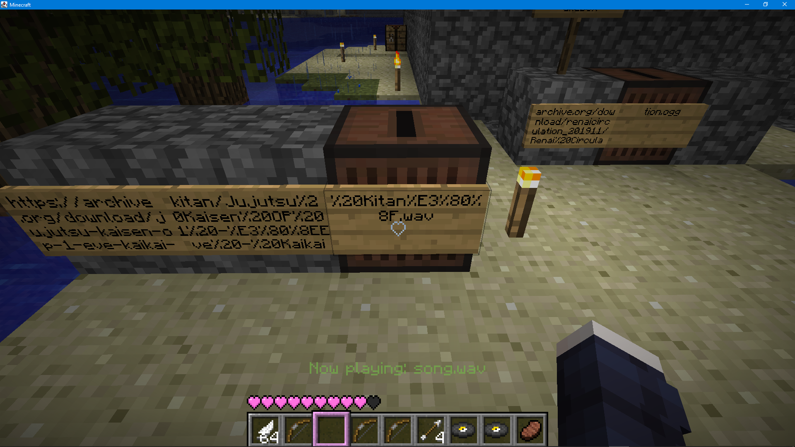
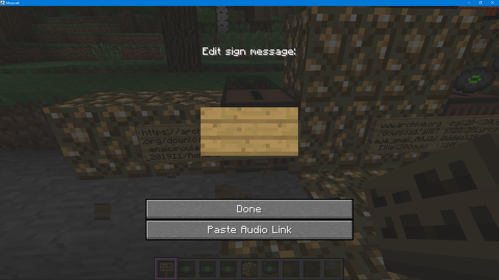

# Signed Music Jukebox (b1.7.3)
Clientside only babric mod that allows playing custom music on Jukeboxes

Plays the URL written on a sign attached to the jukebox instead of the Disc!

Other clients with the mod should also be able to hear the custom music!

Supported formats: `wav, ogg, mid`

`.mid` midi files are technically supported but not reccomended (playback cannot be cancelled until it finishes the song)

# How to use
Have a sign that contains the link to the music file attached to the jukebox,

if your link is > 60 characters, it supports using multiple signs to make up the link

Then insert and eject any disc as usual

The "Paste Audio Link" button will paste any audio link onto the sign in your clipboard, 
it will also detect if part of it is contained in signs to the left, and paste the next remaing 60 or less characters.

# Link notes
You can omit `https://` / `http://` which can be automatically prefixed onto the link to save characters.
